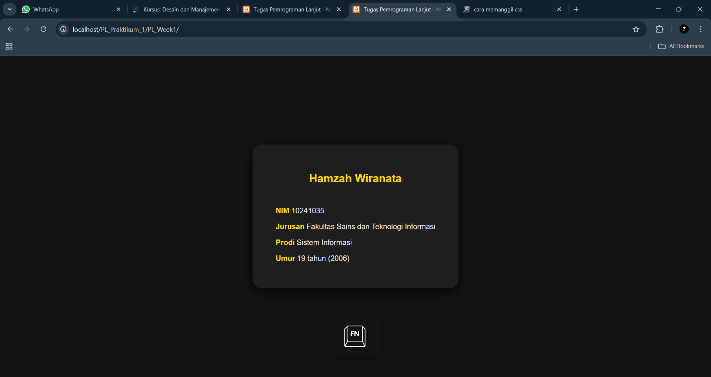

# Template Laporan Praktikum

## Identitas Mahasiswa

- Nama: Hamzah Wiranata
- NIM: 10241035
- Kelas: Pemrograman Lanjut A
- Program Studi: Sistem Informasi
- Minggu ke-: 1
- Tanggal Praktikum: 03/09/2025

---

## Tujuan Praktikum (Ringkas)

- Mahasiswa mampu memastikan lingkungan pengembangan XAMPP berjalan dengan baik.
- Mahasiswa memahami sintaks dasar PHP: tag pembuka/penutup, komentar, dan cara menampilkan output (echo).
- Mahasiswa mampu mendeklarasikan dan menggunakan variabel (string, integer).
- Mahasiswa mampu melakukan operasi aritmatika dasar.

---

## Ringkasan Materi

Praktikum kali ini di gunakan bahasa pemrograman PHP dengan XAMPP untuk server lokal. Mempelajari sintaks dasar php, seperti membuat komentar dan penggunaan `echo` untuk menampilkan outupu, serta deklarasi variabel string dan integer. dan juga mempelajari oprasi aritmatika contohnya tadi untum mencari umur seseorang dengan cara `$tahun_sekarang` - `$tahun_lahir`.

---

## Soal/Tugas (Deskripsi)

### Soal 1 — Biodata Sederhana & Perhitungan Usia

**Deskripsi Soal**  
- Buat file baru `biodata.php` di dalam folder `dasar_php`.
- Buat variabel berikut:
   - `$nama_lengkap` (isi nama Anda)
   - `$nim` (isi NIM Anda)
   - `$jurusan` (isi jurusan Anda)
   - `$tahun_lahir` (format 4 digit, contoh: `2003`)
   - `$tahun_sekarang` (contoh: `2025`)
- Buat variabel `$umur = $tahun_sekarang - $tahun_lahir;`.
- Tampilkan semua informasi ke browser dengan format rapi menggunakan HTML (`<h1>`, `<p>` atau `<br>`).

---

## Jawaban (Kode & Output)

### Jawaban Soal 1

**Lokasi File Utama**: `./path/Biodata/index.php`\
**Lokasi File CSS**: `./path/Biodata/magic_touch.css`

**Kode Program**

*PHP*

```php

// Biodata saya dalam PHP
<?php
$nama = "Hamzah Wiranata";
$nim = "10241035";
$jurusan = "Fakultas Sains dan Teknologi Informasi";
$prodi = "Sistem Informasi";
$tahun_lahir = 2006;
$umur = 2025 - $tahun_lahir;
?>

// HTML untuk di tampilkan di web browser
<!DOCTYPE html>
<html lang="id">
<head>
    <meta charset="UTF-8" />
    <meta name="viewport" content="width=device-width, initial-scale=1" />
    <link rel="stylesheet" href="magic_touch.css"></link>
    <title>Tugas Pemrograman Lanjut - Minggu 2</title>
</head>
<body>
    <div class="kotak" role="main" aria-label="Biodata Hamzah Wiranata">
        <h2><span text-aligh class="kuning_emas"><?= htmlspecialchars($nama) ?></span><br></br></h2>
        <p><span class="kuning_emas">NIM</span> <?= htmlspecialchars($nim) ?></p>
        <p><span class="kuning_emas">Jurusan</span> <?= htmlspecialchars($jurusan) ?></p>
        <p><span class="kuning_emas">Prodi</span> <?= htmlspecialchars($prodi) ?></p>
        <p><span class="kuning_emas">Umur</span> <?= htmlspecialchars($umur) ?> tahun (<?= htmlspecialchars($tahun_lahir) ?>)</p>
    </div>
</body>
</html>
```

*CSS*
```css
body, html {
    height: 100%;
    font-family: 'Poppins', sans-serif;
    background-color: #121212; 
    color: #e0e0e0; 
    display: flex;
    justify-content: center;
    align-items: center;
    padding: 20px;
    text-align: left;
    margin: 0;
    padding: 0;
    box-sizing: border-box;
    transition: background-color 0.5s ease, color 0.5s ease;
}
.kotak {
    background-color: #1e1e1e;
    padding: 40px 50px;
    border-radius: 20px;
    max-width: 400px;
    width: 100%;
    box-shadow: 0 8px 24px rgba(0,0,0,0.7);
    transition: transform 0.3s ease, box-shadow 0.3s ease;
    cursor: default;
}
.kotak:hover {
    transform: scale(1.2);
    box-shadow: 0 12px 40px rgba(0,0,0,0.9);
}
p {
    margin-bottom: 15px;
}
.kuning_emas {
    color: #ffd700;
    font-weight: 600;
}
h2 {
    text-align: center;
}
```

**SS Hasil Output**


**Catatan/Kendala**  
css tidak tampil sebelumnya karena saya hanya mengetikan `<link href="magic_touch.css"></link>` pada html saya pikir hanya di perlukan lokasi css dan akhirnya tidak tampil cssnya, lalu solusinya saya menambahkan `rel="stylesheet"` yang menjadi `<link rel="stylesheet" href="magic_touch.css"></link>` dan akhirnya bisa di jalankan

---

## Pembahasan

_Jelaskan: (1) bagaimana solusi bekerja, (2) alasan pemilihan pendekatan/struktur kode, (3) analisis singkat kompleksitas/performansi bila relevan, (4) pelajaran penting dari kendala yang muncul._

#### (1) Bagaimana solusi bekerja
- Digunakan Server Apache dari XAMPP untuk menjalankan kode PHP. `index.php` digunakan untuk menyimpan data pribadi(Nama, Nim, Jurusan, Tahun Lahir) dalam variabel dan juga untuk menggunakan aritmatika sederhana untuk mengetahui umur berdasarkan tahun lahir. `magic_touch.css` di gunakan untuk desain html yang di sambungkan melalui `<link>` di bagian `<head>`. Jadi PHP dieksekusi di server Apache XAMPP lalu menghasilkan HTML lengkap yang dibaca beowser dengan style dari CSS.
 
#### (2) Alasan Pemilihan Pendekatan/struktur kode
- Pemisahan kode dilakukan agar rapih dan mudah di otak-atik. PHP untuk mengelola variabel dan aritmatika sederhana di dalamnya juga ada HTML untuk struktur konten, lalu ada CSS mengatur desain seperti tata letak, warna, dan ukuran.
#### (3) Analisis Singkat Kompleksitas/performansi bila relevan
- Digunakan berupa deklarasi variabel dan perhitungan aritmatika sederhana, lalu ada penambahan CSS di file berbeda.
#### (4) Pelajaran Penting dari kendala yang muncul
- Kendala yang saya temui yaitu CSS tidak terbaca karena atribut `rel="stylesheet"` tidak ditulis pada tag `<link>`.

---

## Kesimpulan
Praktikum minggu pertama ini mengenalkan XAMPP sebagai alat untuk menjalankan server Apache untuk mengeksekusi kode PHP di Web Browser lalu ada HTML di dalamnya, dan CSS untuk desain seperti tata letak, ukuran, dan warna. 

---

## Checklist Pengumpulan

- [X] Biodata/Identitas lengkap dan benar
- [X] Tujuan dan ringkasan materi diisi singkat-padat
- [X] Setiap soal pada bagian Soal/Tugas memiliki deskripsi jelas
- [X] Setiap jawaban memiliki kode, cara run (jika perlu), dan SS output yang valid
- [X] Kode rapi, dapat dijalankan, dan diberi komentar seperlunya
- [X] Gambar berada di folder yang benar (mis. `./images/…`) dan tampil di laporan
- [X] Instruksi/placeholder dihapus sebelum submit

---

## Catatan Penilaian (Diisi Asisten)

- Kesesuaian solusi dengan soal: \_\_/40
- Kualitas kode (struktur, kerapian, komentar): \_\_/25
- Kelengkapan bukti (SS, uji coba): \_\_/20
- Pembahasan & kesimpulan: \_\_/15

Komentar: tidak ada komentar dari saya