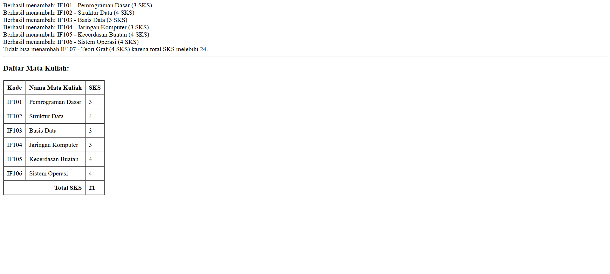

## Identitas Mahasiswa

- Nama: Hamzah Wiranata
- NIM: 10241035
- Kelas: PL-A
- Program Studi: Sistem Informasi
- Minggu ke-: 4
- Tanggal Praktikum: 17/09/2025

---

## Tujuan Praktikum (Ringkas)

- Mengaplikasikan konsep Object-Oriented Programming (OOP) ke dalam bahasa PHP.
- membuat class sederhana dan mengatur atributnya, metodenya dan pengujian.
- Array objek untuk menghitung data yang disimpan dan melihat berapa banyak nilai (SKS).
- Data akan ditampilkan dalam HTML table terstruktur.

---

## Ringkasan Materi

Materi praktikum minggu ini berfokus pada penerapan konsep OOP menggunakan PHP. Praktikan diminta membuat class MataKuliah dengan atribut kode, nama, dan SKS, serta method untuk menampilkan ringkasan. Selain itu, dibuat juga class KRS untuk menyimpan array objek MataKuliah dengan method untuk menambah mata kuliah, menghitung total SKS, dan menampilkan daftar mata kuliah. Output ditampilkan dalam bentuk tabel HTML. Terdapat validasi tambahan agar jumlah SKS tidak melebihi 24, sesuai aturan umum pengisian KRS di perkuliahan.

---

## Soal/Tugas (Deskripsi)

### Soal 1 — KRS

**Deskripsi Soal**

#### Membuat class `MataKuliah` (kode, nama, sks) + method `ringkas()` dan membuat class KRS yang menyimpan array `MataKuliah` dan method `tambah(MataKuliah $mk)`, `totalSks()`, `daftar()` lalu menampikan daftar mata kuliah dan total sks lalu menambah validasi untuk tidak boleh tambah jika total sks > 24

---

## Jawaban (Kode & Output)

### Jawaban Soal 1

**Lokasi File Utama**: `./path/index.php`

**Kode Program**

```PHP
<?php
class MataKuliah {
    private $kode;
    private $nama;
    private $sks;

    public function __construct($kode, $nama, $sks) {
        $this->kode = $kode;
        $this->nama = $nama;
        $this->sks = $sks;
    }

    public function getSks() {
        return $this->sks;
    }

    public function getKode() {
        return $this->kode;
    }

    public function getNama() {
        return $this->nama;
    }

    public function ringkas() {
        return "{$this->kode} - {$this->nama} ({$this->sks} SKS)";
    }
}

class KRS {
    private $matkul = [];

    public function tambah(MataKuliah $mk) {
        if ($this->totalSks() + $mk->getSks() > 24) {
            echo "Tidak bisa menambah {$mk->ringkas()} karena total SKS melebihi 24.<br>";
            return;
        }
        $this->matkul[] = $mk;
        echo "Berhasil menambah: " . $mk->ringkas() . "<br>";
    }

    public function totalSks() {
        $total = 0;
        foreach ($this->matkul as $mk) {
            $total += $mk->getSks();
        }
        return $total;
    }

    public function daftar() {
        echo "<h3>Daftar Mata Kuliah:</h3>";
        echo "<table border='1' cellpadding='8' cellspacing='0'>";
        echo "<tr>
                <th>Kode</th>
                <th>Nama Mata Kuliah</th>
                <th>SKS</th>
              </tr>";

        foreach ($this->matkul as $mk) {
            echo "<tr>
                    <td>{$mk->getKode()}</td>
                    <td>{$mk->getNama()}</td>
                    <td>{$mk->getSks()}</td>
                  </tr>";
        }

        echo "<tr>
                <td colspan='2' align='right'><strong>Total SKS</strong></td>
                <td><strong>" . $this->totalSks() . "</strong></td>
              </tr>";
        echo "</table>";
    }
}

$krs = new KRS();

$mk1 = new MataKuliah("SI101", "Desain Proses Bisnis", 4);
$mk2 = new MataKuliah("SI102", "Pemrograman Lanjut", 3);
$mk3 = new MataKuliah("SI103", "Desain Manajemen dan Komputer", 4);
$mk4 = new MataKuliah("SI104", "Interaksi Manusia dan Komputer", 3);
$mk5 = new MataKuliah("SI105", "Basis Data", 3);
$mk6 = new MataKuliah("SI106", "Konsep Sistem Informasi", 2);
$mk7 = new MataKuliah("SI107", "Statistika Sistem Informasi", 3);
$mk8 = new MataKuliah("SI108", "Matematika Diskrit 2", 3);

$krs->tambah($mk1);
$krs->tambah($mk2);
$krs->tambah($mk3);
$krs->tambah($mk4);
$krs->tambah($mk5);
$krs->tambah($mk6);
$krs->tambah($mk7);
$krs->tambah($mk8);

echo "<hr>";
$krs->daftar();
?>

```

**SS Hasil Output**


---

## Pembahasan

(1) Program bekerja dengan membuat objek MataKuliah yang menyimpan informasi mata kuliah. Objek-objek ini kemudian dimasukkan ke dalam KRS.\
(2) Struktur class dipilih agar modular dan sesuai prinsip OOP: MataKuliah sebagai entitas data, KRS sebagai pengelola daftar mata kuliah.\
(3) Kompleksitas program sederhana, operasi penambahan dan perhitungan total SKS berjalan linear terhadap jumlah mata kuliah.\
(4) Kendala yang muncul terutama pada validasi SKS, namun dapat diatasi dengan pengecekan jumlah sebelum menambah mata kuliah baru.

---

## Kesimpulan

- Praktikum ini melatih penerapan konsep OOP dalam PHP melalui contoh nyata pengisian KRS.

- Validasi SKS maksimal 24 berhasil diterapkan untuk mencegah overload mata kuliah.

- Saya beri tabel mempermudah visualisasi hasil program dan membuat data lebih rapi.

---

## Checklist Pengumpulan

- [x] Biodata/Identitas lengkap dan benar
- [x] Tujuan dan ringkasan materi diisi singkat-padat
- [x] Setiap soal pada bagian Soal/Tugas memiliki deskripsi jelas
- [x] Setiap jawaban memiliki kode, cara run (jika perlu), dan SS output yang valid
- [x] Kode rapi, dapat dijalankan, dan diberi komentar seperlunya
- [x] Gambar berada di folder yang benar (mis. `./images/…`) dan tampil di laporan
- [x] Instruksi/placeholder dihapus sebelum submit

---

## Catatan Penilaian (Diisi Asisten)

- Kesesuaian solusi dengan soal: \_\_/40
- Kualitas kode (struktur, kerapian, komentar): \_\_/25
- Kelengkapan bukti (SS, uji coba): \_\_/20
- Pembahasan & kesimpulan: \_\_/15

Komentar: _…_
