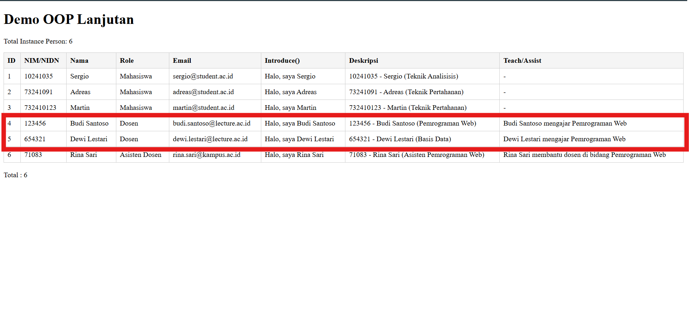
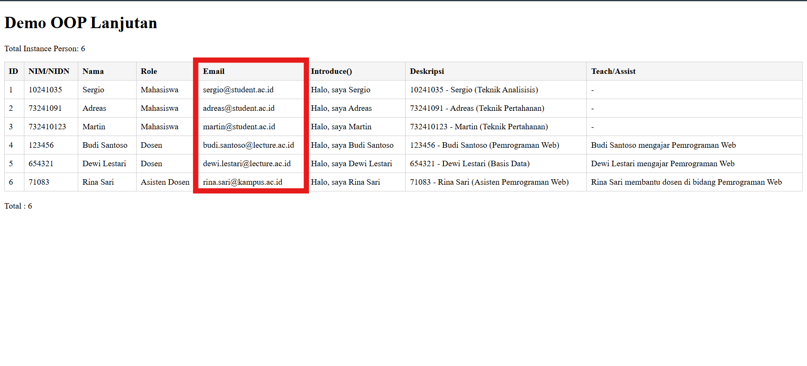
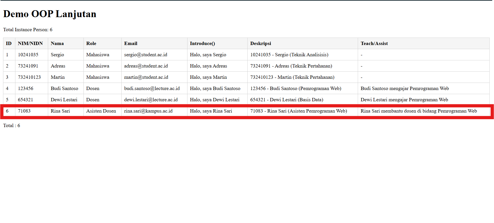

# Template Laporan Praktikum

## Identitas Mahasiswa

- Nama: Hamzah Wiranata
- NIM: 10241035
- Kelas: PL-A
- Program Studi: Sistem Informasi
- Minggu ke-: 4
- Tanggal Praktikum: 24/09/2025

---

## Tujuan Praktikum (Ringkas)

- Memahami inheritance (pewarisan) antar class.
- Menggunakan abstract class & abstract method.
- Mengimplementasikan interface.
- Memakai trait untuk reuse perilaku.
- Memahami properti & method `static`.
- Menggunakan autoload sederhana (`spl_autoload_register`).
- Menerapkan namespace untuk struktur rapi.

---

## Ringkasan Materi

- Inheritance: class Anak mewarisi properti & method dari class Induk (`extends`).
- Abstract Class: tidak bisa di-instansiasi langsung, bisa punya method abstract (harus diimplementasi di turunan) + method biasa.
- Interface: hanya deklarasi method; class bisa mengimplementasikan banyak interface.
- Trait: potongan kode (method / properti) untuk disisipkan ke beberapa class (avoid duplicate code).
- Static: milik class, bukan object; akses via `NamaClass::methodStatic()`.
- Autoload: otomatis memanggil file class saat dibutuhkan tanpa banyak `require`.
- Namespace: mencegah bentrok nama dan mengelompokkan kode.

---

## Soal/Tugas (Deskripsi)

### Soal 1 — Tambah class `Dosen`

**Deskripsi Soal**  
- Tambah class `Dosen` yang extends `Person` (punya properti `nidn` & `keahlian`).
- Implementasikan method `deskripsi()` pada `Dosen` menampilkan: `NIDN - Nama (Keahlian)`.

---

### Soal 2 — Buat interface baru `HasContact`

**Deskripsi Soal**  
Buat interface baru `HasContact` dengan method `getEmail(): string` lalu implement di `Dosen` & `Mahasiswa` (email sederhana: lower(nama)@kampus.ac.id, spasi menjadi titik).

---

### Soal 3 — Buat trait `CanTeach`

**Deskripsi Soal**  
- Buat trait `CanTeach` dengan method `teach($mataKuliah)` (return string). Gunakan di `Dosen` saja.
- Tampilkan di index:
   - Daftar semua Person (Mahasiswa & Dosen) dengan role & email.
   - Panggil `teach()` untuk objek `Dosen`.
   - Total instance Person.
---

### Soal 4 — Tambah class `AsistenDosen`

**Deskripsi Soal**  
Tambah class `AsistenDosen` extends `Mahasiswa` + implement interface tambahan buatan kamu sendiri.

---

## Jawaban (Kode & Output)

### Jawaban Soal 1

**Lokasi File Utama**: `./path/arc/Models/Dosen.php`

**Kode Program**

```PHP
<?php
namespace App\Models;

use App\Traits\CanIntroduce;
use App\Traits\CanTeach;
use App\Interfaces\HasIdentity;
use App\Interfaces\HasContact;

class Dosen extends Person implements HasIdentity, HasContact {
    use CanIntroduce, CanTeach;
    private string $nidn;
    private string $keahlian;
    private string $email;

    public function __construct(string $id, string $name, string $nidn, string $keahlian) {
        parent::__construct($id, $name);
        $this->nidn = $nidn;
        $this->keahlian = $keahlian;
        $this->email = strtolower(str_replace(' ', '.', $name)) . '@lecture.itk.ac.id';
    }
    public function getRole(): string {
        return 'Dosen';
    }
    public function deskripsi(): string {
        return $this->nidn . ' - ' . $this->getNama() . ' (' . $this->keahlian . ')';
    }
    public function getNidn(): string {
        return $this->nidn;
    }
    public function getKeahlian(): string {
        return $this->keahlian;
    }
    public function getEmail(): string {
        return $this->email;
    }
}
```

**SS Hasil Output**

---

### Jawaban Soal 2

**Lokasi File Utama**: `./path/arc/Interfaces/HasContact.php`

**Kode Program**

```PHP
<?php
namespace App\Interfaces;

interface HasContact {
    public function getEmail(): string;
}

```

Di Mahasiswa
```PHP
public function __construct(string $id, string $name, string $nim, string $jurusan) {
    parent::__construct($id, $name);
    $this->nim = $nim;
    $this->jurusan = $jurusan;
    $this->email = strtolower(str_replace(' ', '.', $name)) . '@kampus.ac.id';
}
```

Di Asisten Dosen
```PHP
public function __construct(string $id, string $name, string $nim, string $jurusan, string $bidangAsistensi) {
    parent::__construct($id, $name, $nim, $jurusan);
    $this->bidangAsistensi = $bidangAsistensi;
    $this->email = strtolower(str_replace(' ', '.', $name)) . '@kampus.ac.id';
}
```

Di Dosen
```PHP
public function __construct(string $id, string $name, string $nidn, string $keahlian) {
    parent::__construct($id, $name);
    $this->nidn = $nidn;
    $this->keahlian = $keahlian;
    $this->email = strtolower(str_replace(' ', '.', $name)) . '@kampus.ac.id';
}
```
**SS Hasil Output**

---

### Jawaban Soal 3

**Lokasi File Utama**: `./path/arc/Traits/CanTeach.php`

**Kode Program**

```PHP
<?php
namespace App\Traits;

trait CanTeach {
    public function teach($mataKuliah): string {
        return $this->getNama() . ' mengajar ' . $mataKuliah;
    }
}

```

**SS Hasil Output**

---

### Jawaban Soal 4

**Lokasi File Utama**: `./path/arc/Models/AsistenDosen.php`

**Kode Program**

```PHP
<?php
namespace App\Models;

use App\Interfaces\HasContact;
use App\Interfaces\CanAssist;

class AsistenDosen extends Mahasiswa implements HasContact, CanAssist {
    private string $email;
    private string $bidangAsistensi;

    public function __construct(string $id, string $name, string $nim, string $jurusan, string $bidangAsistensi) {
        parent::__construct($id, $name, $nim, $jurusan);
        $this->bidangAsistensi = $bidangAsistensi;
        $this->email = strtolower(str_replace(' ', '.', $name)) . '@student.itk.ac.id';
    }
    public function getRole(): string {
        return 'Asisten Dosen';
    }
    public function deskripsi(): string {
        return $this->getNim() . ' - ' . $this->getNama() . ' (Asisten ' . $this->bidangAsistensi . ')';
    }
    public function getEmail(): string {
        return $this->email;
    }
    public function assist(): string {
        return $this->getNama() . ' membantu dosen di bidang ' . $this->bidangAsistensi;
    }
}
```

**SS Hasil Output**

---

## Pembahasan


Pada praktikum ini, saya mempelajari konsep OOP lanjutan di PHP, seperti inheritance, abstract class, interface, trait, static property/method, autoload, dan namespace. Setiap soal mengarahkan untuk mengimplementasikan fitur OOP tersebut secara bertahap:

- Pada soal 1, saya membuat class `Dosen` yang mewarisi `Person` dan menambah properti serta method khusus dosen. Implementasi method `deskripsi()` menampilkan informasi dosen sesuai format yang diminta.
- Pada soal 2, saya membuat interface `HasContact` dan mengimplementasikannya di class `Dosen` dan `Mahasiswa` agar keduanya memiliki method `getEmail()`. Email dihasilkan otomatis dari nama.
- Pada soal 3, trait `CanTeach` dibuat agar dapat digunakan oleh class `Dosen` untuk menambah perilaku mengajar tanpa duplikasi kode. Di index, seluruh objek ditampilkan beserta role dan email, serta memanggil method teach untuk dosen.
- Pada soal 4, class `AsistenDosen` dibuat sebagai turunan `Mahasiswa` dan mengimplementasikan interface tambahan. Ini memperkuat pemahaman tentang multiple interface dan pewarisan.

Selama pengerjaan, saya juga belajar menggunakan autoloader agar file class otomatis ter-load, serta menerapkan namespace agar struktur kode lebih rapi dan terhindar dari bentrok nama class. Pengujian dilakukan dengan menampilkan output di index.php dan memastikan seluruh fitur berjalan sesuai ekspektasi.


## Kesimpulan


1. Praktikum ini memperdalam pemahaman konsep OOP lanjutan di PHP, seperti inheritance, abstract class, interface, trait, static, autoload, dan namespace.
2. Implementasi interface dan trait sangat membantu dalam membuat kode yang reusable dan mudah dikembangkan.
3. Struktur kode menjadi lebih rapi dan terorganisir dengan penggunaan autoloader dan namespace, serta memudahkan pengelolaan banyak class dalam proyek besar.

---

## Lampiran (Opsional)

- Daftar file/direktori yang dibuat
- Data uji, konfigurasi, atau catatan tambahan

---

## Checklist Pengumpulan

- [X] Biodata/Identitas lengkap dan benar
- [X] Tujuan dan ringkasan materi diisi singkat-padat
- [X] Setiap soal pada bagian Soal/Tugas memiliki deskripsi jelas
- [X] Setiap jawaban memiliki kode, cara run (jika perlu), dan SS output yang valid
- [X] Kode rapi, dapat dijalankan, dan diberi komentar seperlunya
- [X] Gambar berada di folder yang benar (mis. `./images/…`) dan tampil di laporan
- [X] Instruksi/placeholder dihapus sebelum submit

---

## Catatan Penilaian (Diisi Asisten)

- Kesesuaian solusi dengan soal: \_\_/40
- Kualitas kode (struktur, kerapian, komentar): \_\_/25
- Kelengkapan bukti (SS, uji coba): \_\_/20
- Pembahasan & kesimpulan: \_\_/15

Komentar: _…_
