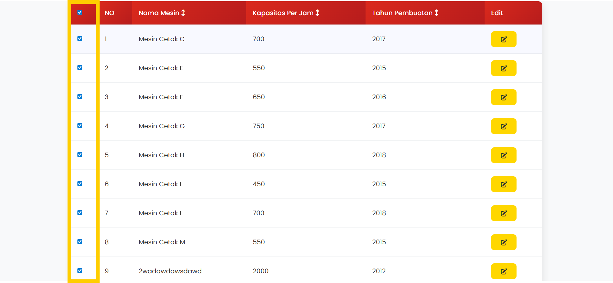
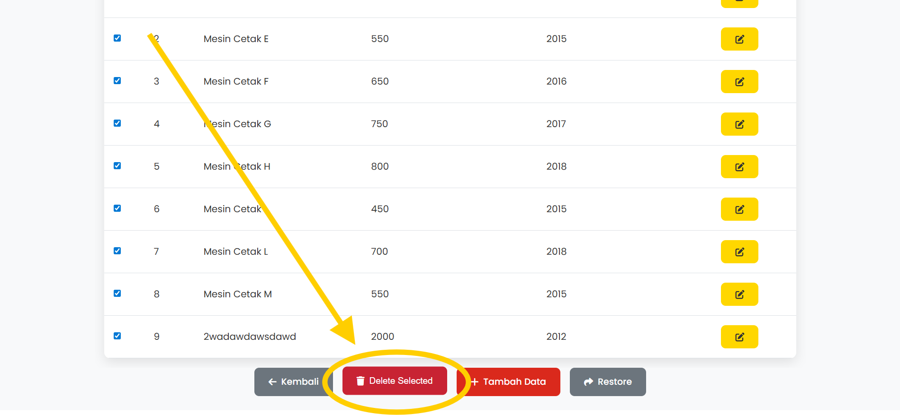
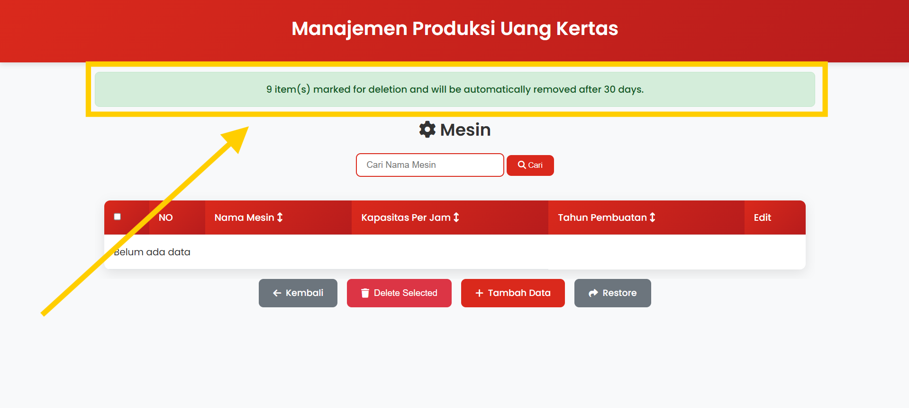
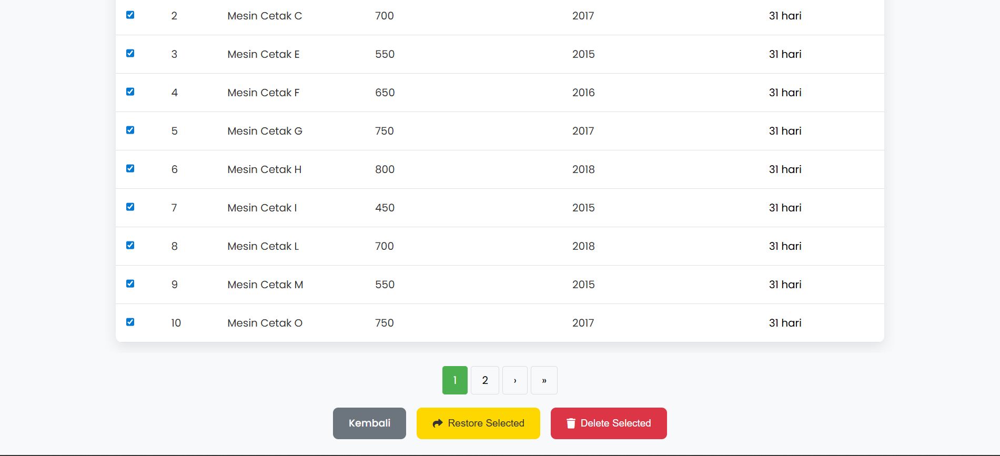
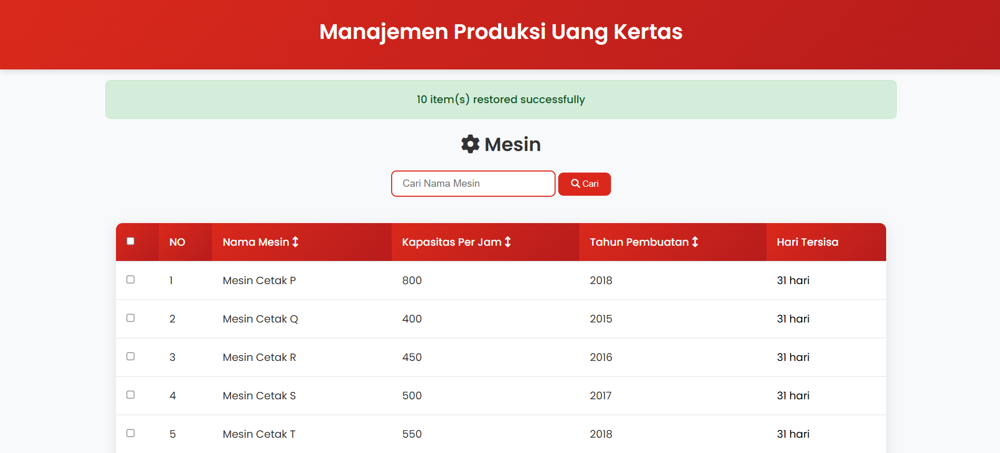
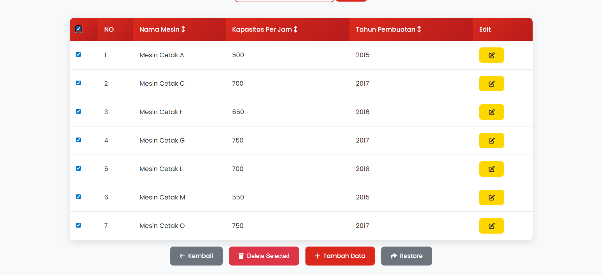
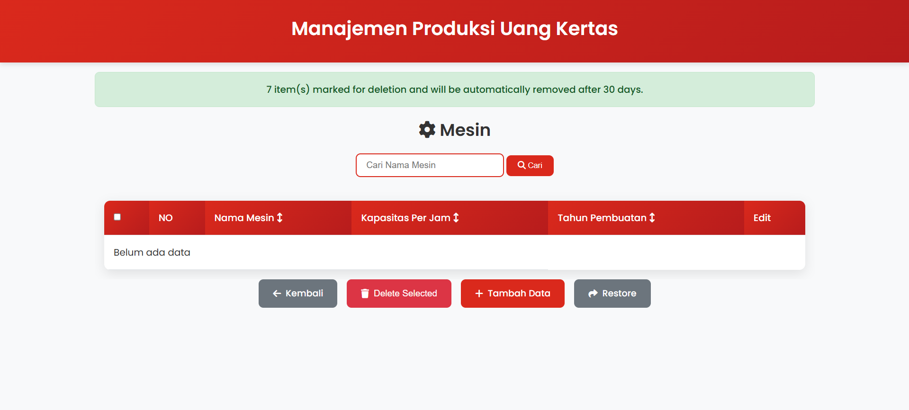
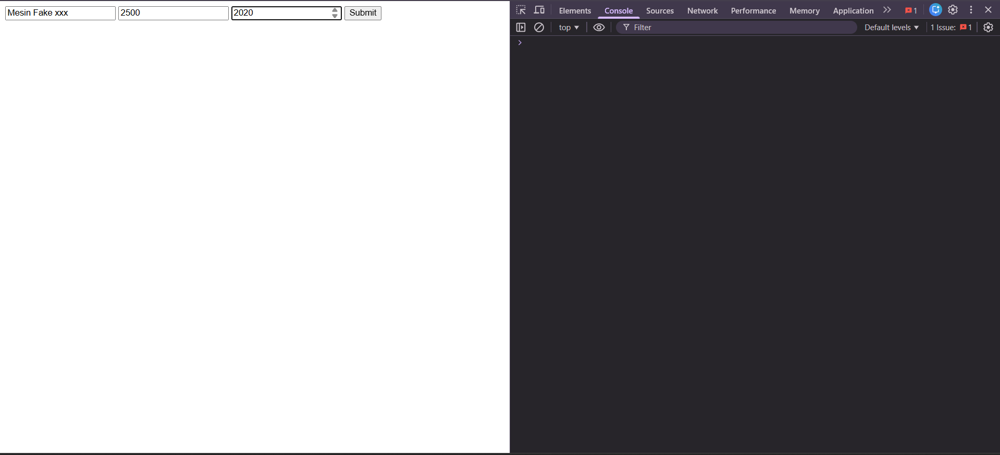
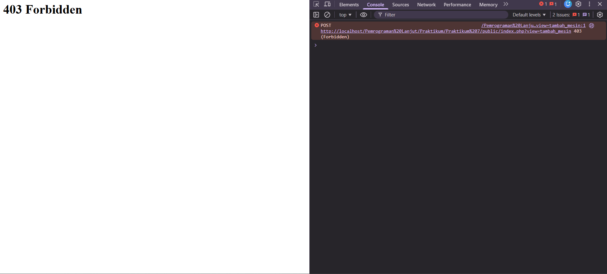

## Identitas Mahasiswa

- Nama: Hamzah Wiranata
- NIM: 10241035
- Kelas: PL-A
- Program Studi: Sistem Informasi
- Minggu ke-: 7
- Tanggal Praktikum: 22/10/2025
---
- Github : https://github.com/hamzahwiranataa/Pemrograman-Lanjut
---

## Jawaban Soal 1

#### Extend Validator
- in($array)\
    Code di Controllers
    Berfungsi pada Tambah Mesin bagian Kapasitas Per Jam Mesin

    ```php
        $this->validator->in($kapasitas_per_jam, 'Kapasitas Per Jam', $Opsi_Kapasitas_Per_Jam);
    ```

    Code di Validator
    ```php
        public function in($value, $field, $options){
            if(!in_array($value, $options)){
                $this->errors[$field][] = "Field $field harus salah satu dari: " . implode(", ", $options) . ".";
            }
        }
    ```
- between($min, $max)\
    Code di Controllers
    Berfungsi Pada Tambah Mesin bagian Tahun pembuatan
    ```php
        $this->validator->between($tahun_pembuatan, 2010, date('Y'), 'Tahun Pembuatan');
    ```

    Code di Validator
    ```php
        public function between($value, $min, $max, $field) {
            if($value < $min || $value > $max) {
                $this->errors[$field][] = "Field $field harus antara $min dan $max.";
            }
        }    
    ```

- unique($value, $field, $table, $column, $exceptId = null)
    Code di Controllers
    Berfungsi Pada Tambah Operator bagian Nomor HP agar tidak nomor tidak ada yang sama
    ```php
        $this->validator->unique($nomor, 'Nomor', 'operators', 'nomor');
    ```

    Code di Validator
    ```php
        public function unique($value, $field, $table, $column, $exceptId = null)
        {
            if (!$this->db) return;

            $sql = "SELECT COUNT(*) AS total FROM $table WHERE $column = ?";
            $params = [$value];

            if ($exceptId) {
                $sql .= " AND id != ?";
                $params[] = $exceptId;
            }

            $stmt = $this->db->prepare($sql);
            $types = str_repeat('s', count($params));
            $stmt->bind_param($types, ...$params);
            $stmt->execute();
            $result = $stmt->get_result();
            $count = $result->fetch_assoc()['total'];

            if ($count > 0) {
                $this->errors[$field][] = "Field $field sudah digunakan.";
            }
        }
    ```

## Jawaban Soal 2

#### Factory Pattern
- create()
    - BahanBakuFactory
        ```php
        public function create($nama, $jenis, $stok)
        {
            $sql = "INSERT INTO bahan_baku (nama_bahan, jenis, stok) VALUES (?, ?, ?)";
            $stmt = $this->conn->prepare($sql);
            $stmt->bind_param('ssi', $nama, $jenis, $stok);
            $stmt->execute();

            return $this->conn->insert_id;
        }
        ?>      
        ```
    - MesinFactory
        ```php
        public function create($nama_mesin, $kapasitas, $tahun)
        {
            $sql = "INSERT INTO mesin (nama_mesin, kapasitas_per_jam, tahun_pembuatan) VALUES (?, ?, ?)";
            $stmt = $this->conn->prepare($sql);
            $stmt->bind_param('sii', $nama_mesin, $kapasitas, $tahun);
            $stmt->execute();

            return $this->conn->insert_id;
        }
        ```

    - OperatorFactory
        ```php
        <?php
        require_once '/../core/database.php';

        class OperatorFactory extends Database
        {
            public function create($nama, $shift)
            {
                $sql = "INSERT INTO operator (nama, shift) VALUES (?, ?)";
                $stmt = $this->conn->prepare($sql);
                $stmt->bind_param('ss', $nama, $shift);
                $stmt->execute();

                return $this->conn->insert_id;
            }
        ```

    - ProduksiFactory
        ```php
        public function create($tanggal, $jumlah, $mesin_id, $bahan_id, $operator_id)
        {
            $sql = "INSERT INTO produksi (tanggal, jumlah_lembar, mesin_id, bahan_id, operator_id)
                    VALUES (?, ?, ?, ?, ?)";
            $stmt = $this->conn->prepare($sql);
            $stmt->bind_param('siiii', $tanggal, $jumlah, $mesin_id, $bahan_id, $operator_id);
            $stmt->execute();

            return $this->conn->insert_id;
        }        
        ```

    - QualityCHeckFactory.php
        ```php
        public function create($produksi_id, $tingkat_cacat, $jumlah, $status, $catatan)
        {
            $sql = "INSERT INTO quality_check (produksi_id, tingkat_cacat, jumlah, status, catatan)
                    VALUES (?, ?, ?, ?, ?)";
            $stmt = $this->conn->prepare($sql);
            $stmt->bind_param('iiiss', $produksi_id, $tingkat_cacat, $jumlah, $status, $catatan);
            $stmt->execute();

            return $this->conn->insert_id;
        }        
        ```  
- createMany()
    - BahanBakuFactory
        ```php
        public function createMany($jumlah)
        {
            $jenisList = ['Kertas', 'Tinta', 'Polimer'];
            for ($i = 0; $i < $jumlah; $i++) {
                $nama = "Bahan " . chr(65 + $i);
                $jenis = $jenisList[array_rand($jenisList)];
                $stok = rand(100, 1000);
                $this->create($nama, $jenis, $stok);
            }
        }
        ```
    - MesinFactory
        ```php
        public function createMany($jumlah)
        {
            for ($i = 0; $i < $jumlah; $i++) {
                $this->create("Mesin " . chr(65 + $i), rand(1000, 5000), rand(2000, 2023));
            }
        }
        ```

    - OperatorFactory
        ```php
        public function createMany($jumlah)
        {
            $shiftList = ['pagi', 'siang', 'malam'];
            for ($i = 0; $i < $jumlah; $i++) {
                $nama = "Operator " . chr(65 + $i);
                $shift = $shiftList[array_rand($shiftList)];
                $this->create($nama, $shift);
            }
        }
        ```

    - ProduksiFactory
        ```php
        public function createMany($jumlah)
        {
            for ($i = 0; $i < $jumlah; $i++) {
                $this->create(
                    date('Y-m-d', strtotime("-$i days")),
                    rand(500, 5000),
                    rand(1, 5),
                    rand(1, 5),
                    rand(1, 5)
                );
            }
        }        
        ```

    - QualityCheckFactory
        ```php
        public function createMany($jumlah)
        {
            $statusList = ['lulus', 'ulang'];
            for ($i = 0; $i < $jumlah; $i++) {
                $this->create(
                    rand(1, 10),
                    rand(0, 10),
                    rand(100, 1000),
                    $statusList[array_rand($statusList)],
                    'Cek kualitas ke-' . ($i + 1)
                );
            }
        }        
        ``` 
## Jawaban Soal Nomor 3

#### Week 6 Enhancement - Recycle Bin

### 1. Auto-Delete (`autoDeleteOld`)

A. Hard delete records yang deleted_at
Method di Repository untuk menghapus permanen record yang sudah di-soft-delete lebih dari 30 hari:
```php
public function autoDeleteOld($days = 30) {
    try {
        $cutoff_date = date('Y-m-d H:i:s', strtotime("-$days days"));
        
        $stmt = $this->db->prepare("SELECT COUNT(*) FROM {$this->table} WHERE deleted_at <= ?");
        $stmt->execute([$cutoff_date]);
        $count = $stmt->fetchColumn();
        
        $stmt = $this->db->prepare("DELETE FROM {$this->table} WHERE deleted_at <= ?");
        $stmt->execute([$cutoff_date]);
        
        return [
            'success' => true,
            'count' => $count,
            'message' => "$count records permanently deleted."
        ];
    } catch (\PDOException $e) {
        return [
            'success' => false,
            'count' => 0,
            'message' => "Error: " . $e->getMessage()
        ];
    }
}
```

B. Controller action + flash message berapa record terhapus

Controller action untuk auto-delete menggunakan parameter hari (default 30 hari) dan menampilkan flash message berapa record yang terhapus:

```php
case 'auto_delete':
    $days = isset($_GET['days']) ? (int)$_GET['days'] : 30;
    $result = $this->repository->autoDeleteOld($days);
    
    if ($result['success']) {
        $_SESSION['flash_message'] = "Successfully deleted {$result['count']} old records";
        $_SESSION['flash_type'] = 'success';
    } else {
        $_SESSION['flash_message'] = $result['message'];
        $_SESSION['flash_type'] = 'error';
    }
    
    header("Location: " . $_SERVER['HTTP_REFERER'] ?? 'index.php');
    exit;
    break;
```

Penjelasan kode:
1. Parameter `$days` diambil dari URL query parameter, default 30 hari
2. Memanggil method `autoDeleteOld()` dari repository yang mengembalikan:
   - `success`: boolean status berhasil/gagal
   - `count`: jumlah record yang terhapus
   - `message`: pesan sukses/error
3. Flash message disimpan di session:
   - Sukses: menampilkan jumlah record yang terhapus
   - Error: menampilkan pesan error dari repository
4. Menggunakan `$_SESSION['flash_type']` untuk styling pesan (success/error)
5. Redirect kembali ke halaman sebelumnya

### 2. Bulk Restore

A. View Template (checkbox dan tombol bulk action):
```php
<form id="bulkForm" method="POST" action="index.php?view=bulk_action">
    <input type="checkbox" onclick="toggleCheckboxes(this)">
    
    <table>
        <?php foreach($data as $item): ?>
        <tr>
            <td><input type="checkbox" name="ids[]" value="<?= $item['id'] ?>"></td>
            <!-- kolom lainnya -->
        </tr>
        <?php endforeach; ?>
    </table>

    <button name="action" value="restore">Restore Selected</button>
    <button name="action" value="delete">Delete Selected</button>
</form>

<script>
function toggleCheckboxes(source) {
    const checkboxes = document.querySelectorAll('input[name="ids[]"]');
    checkboxes.forEach(cb => cb.checked = source.checked);
}
</script>
```

B. Repository Methods:
```php
public function restoreBulk($table, $ids) {
    try {
        $placeholders = str_repeat('?,', count($ids) - 1) . '?';
        $sql = "UPDATE $table SET deleted_at = NULL WHERE id IN ($placeholders)";
        $stmt = $this->db->prepare($sql);
        $stmt->execute($ids);
        return [
            'success' => true,
            'message' => count($ids) . ' items restored'
        ];
    } catch (\PDOException $e) {
        return [
            'success' => false,
            'message' => 'Error restoring items: ' . $e->getMessage()
        ];
    }
}

public function forceDeleteBulk($table, $ids) {
    try {
        $placeholders = str_repeat('?,', count($ids) - 1) . '?';
        $sql = "DELETE FROM $table WHERE id IN ($placeholders)";
        $stmt = $this->db->prepare($sql);
        $stmt->execute($ids);
        return [
            'success' => true,
            'message' => count($ids) . ' items permanently deleted'
        ];
    } catch (\PDOException $e) {
        return [
            'success' => false,
            'message' => 'Error deleting items: ' . $e->getMessage()
        ];
    }
}
```

C. Controller Action:
```php
case 'bulk_action':
    $ids = isset($_POST['ids']) && is_array($_POST['ids']) 
         ? array_map('intval', $_POST['ids']) 
         : [];
    $action = $_POST['action'] ?? '';
    $view = $_POST['view'] ?? '';

    $table = '';
    if (strpos($view, 'mesin') !== false) $table = 'mesin';
    elseif (strpos($view, 'bahan_baku') !== false) $table = 'bahan_baku';
    elseif (strpos($view, 'operator') !== false) $table = 'operator';
    elseif (strpos($view, 'produksi') !== false) $table = 'produksi';
    elseif (strpos($view, 'quality_check') !== false) $table = 'quality_check';

    if (!empty($ids) && !empty($table)) {
        if ($action === 'restore') {
            $result = $this->repository->restoreBulk($table, $ids);
        } elseif ($action === 'delete') {
            $result = $this->repository->forceDeleteBulk($table, $ids);
        }
        
        $_SESSION['flash_message'] = $result['message'];
        $_SESSION['flash_type'] = $result['success'] ? 'success' : 'error';
    } else {
        $_SESSION['flash_message'] = 'Please select at least one item.';
        $_SESSION['flash_type'] = 'error';
    }

    header("Location: index.php?view={$view}");
    exit;
    break;
```

### Screenshot

1. Select ALL


2. Delete Selected


Hasil Flash Message


3. Restroe Selected


Hasil Flash Message


4. forceDeleteBulk


Hasil Flash Message


## Jawaban Soal 4

### Helper Classes (10%)

#### A. Sanitizer Enhancement (6%)
Menambahkan 3 methods baru untuk sanitasi input:

1. phone($value) - Format nomor telepon Indonesia
```php
public static function phone($value) 
{
    $number = preg_replace('/[^0-9]/', '', $value);
    
    if (substr($number, 0, 2) === '62') {
        $number = '0' . substr($number, 2);
    }
 
    return '+62-' . substr($number, 1, 3) . '-' . 
           substr($number, 4, 4) . '-' . 
           substr($number, 8);
}
```

2. name($value) - Kapitalisasi nama dan hapus karakter khusus
```php
public static function name($value) 
{

    $name = preg_replace('/[^a-zA-Z\s]/', '', $value);
    
 
    return ucwords(strtolower($name));
}
```

3. alphanumeric($value) - Filter hanya huruf dan angka
```php
public static function alphanumeric($value) 
{
    return preg_replace('/[^a-zA-Z0-9]/', '', $value);
}
```

#### B. DateHelper (4%)
Class baru dengan 5 methods untuk manipulasi tanggal:

```php
class DateHelper {

    public static function format($date, $format = 'Y-m-d') {
        return date($format, strtotime($date));
    }

    public static function age($birthdate) {
        return date_diff(date_create($birthdate), date_create('today'))->y;
    }

    public static function diffHuman($date) {
        $diff = time() - strtotime($date);
        
        if ($diff < 60) return $diff . " detik yang lalu";
        if ($diff < 3600) return round($diff/60) . " menit yang lalu";
        if ($diff < 86400) return round($diff/3600) . " jam yang lalu";
        return round($diff/86400) . " hari yang lalu";
    }

    public static function toMysql($date) {
        return date('Y-m-d H:i:s', strtotime($date));
    }

    public static function isWeekend($date) {
        return in_array(date('N', strtotime($date)), [6,7]);
    }
}

```

## CSRF Protection

### Implementasi Core Class

```php
class Csrf {
    public static function generateToken() {
        if (empty($_SESSION['csrf_token'])) {
            $_SESSION['csrf_token'] = bin2hex(random_bytes(32));
        }
        return $_SESSION['csrf_token'];
    }

    public static function verifyToken($token) {
        if (empty($_SESSION['csrf_token'])) {
            return false;
        }
        return hash_equals($_SESSION['csrf_token'], $token);
    }

    public static function verifyOrFail($token) {
        if (!self::verifyToken($token)) {
            http_response_code(403);
            die('CSRF token verification failed');
        }
    }

    public static function inputField() {
        $token = self::generateToken();
        return '<input type="hidden" name="csrf_token" value="' . $token . '">';
    }
}
```

### Implementasi di Form

Form yang sudah diproteksi CSRF (contoh form tambah mesin):
```php
<form method="POST" action="index.php?view=tambah_mesin">
    <?= Csrf::inputField() ?>
    
    <div class="form-group">
        <label>Nama Mesin:</label>
        <input type="text" name="nama_mesin" required>
    </div>

    <div class="form-group">
        <label>Kapasitas Per Jam:</label>
        <select name="kapasitas_per_jam">
            <option value="500">500</option>
            <option value="1000">1000</option>
            <option value="1500">1500</option>
            <option value="2000">2000</option>
            <option value="2500">2500</option>
        </select>
    </div>

    <div class="form-group">
        <label>Tahun Pembuatan:</label>
        <input type="number" name="tahun_pembuatan" required>
    </div>

    <button type="submit">Simpan</button>
</form>
```

### Verifikasi di Controller

Contoh verifikasi token di controller:
```php
case 'tambah_mesin':
    if ($_SERVER['REQUEST_METHOD'] === 'POST') {
        Csrf::verifyOrFail($_POST['csrf_token'] ?? '');
        
        $nama_mesin = $_POST['nama_mesin'];
        $kapasitas_per_jam = Sanitizer::alphanumeric($_POST['kapasitas_per_jam']);
        $tahun_pembuatan = $_POST['tahun_pembuatan'];

        $Opsi_Kapasitas_Per_Jam = [500, 1000, 1500, 2000, 2500];
        $this->validator->in($kapasitas_per_jam, 'Kapasitas Per Jam', $Opsi_Kapasitas_Per_Jam);
        $this->validator->between($tahun_pembuatan, 2010, date('Y'), 'Tahun Pembuatan');

        if (!empty($this->validator->errors())) {
            $errors = $this->validator->errors();
            require_once "../app/views/form/tambah.php";
            break;
        }

        $this->model->addMesin($nama_mesin, $kapasitas_per_jam, $tahun_pembuatan);
        header("Location: index.php?view=mesin");
        exit;
    }
    require_once "../app/views/form/tambah.php";
    break;
```

### Test CSRF Protection

File: csrf-test.html
```html
<!DOCTYPE html>
<html>
<head>
    <title>CSRF Test</title>
</head>
<body>
    <form method="POST" action="index.php?view=tambah_mesin">
        <input type="text" name="nama_mesin">
        <input type="number" name="kapasitas_per_jam">
        <input type="number" name="tahun_pembuatan">    
        <button type="submit">Submit</button>
    </form>
</body>
</html>
```

### Screenshot Hasil Test


1. Response 403 saat mencoba akses tanpa token:
- Tanpa Token
    

- Setelah Mencoba Submit
    

