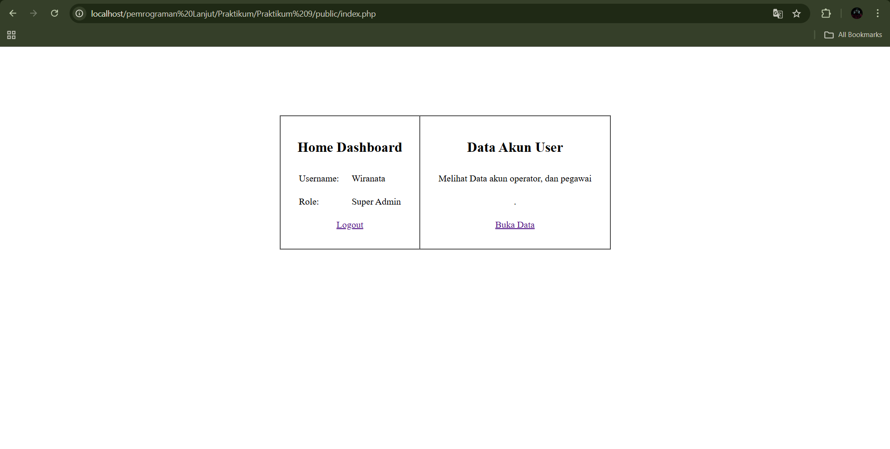
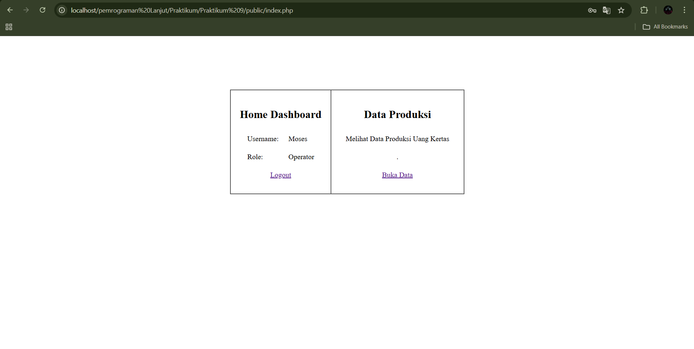
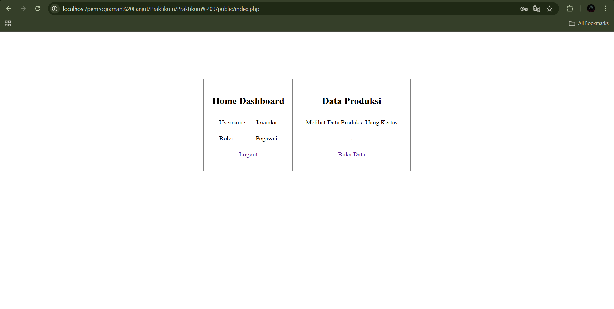
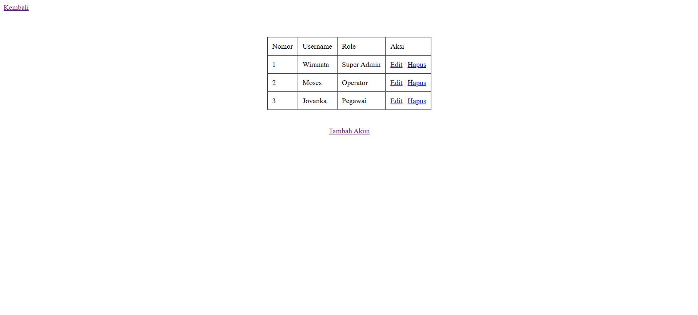
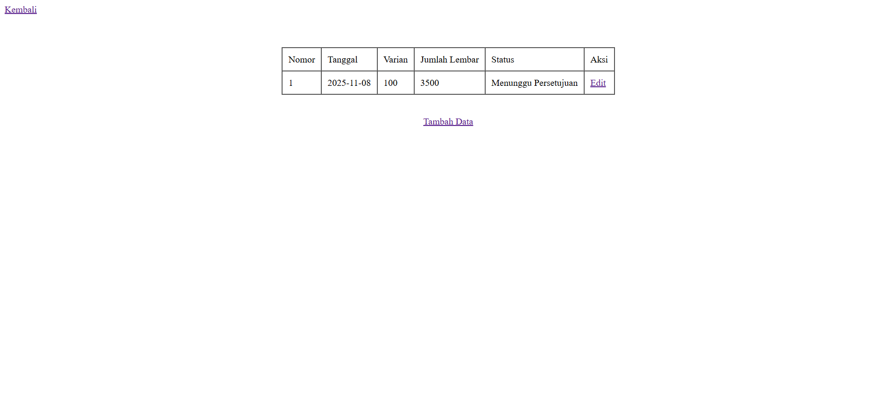
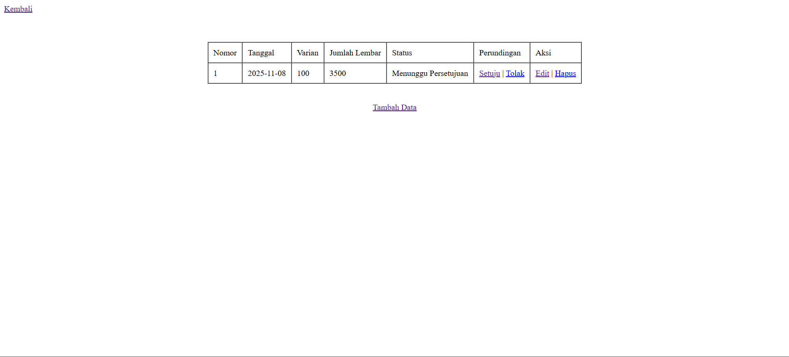

## Identitas Mahasiswa

- Nama: Hamzah Wiranata
- NIM: 10241035
- Kelas: PL-A
- Program Studi: Sistem Informasi
- Minggu ke-: 9
- Tanggal Praktikum: 5/11/2025
---
- Github : https://github.com/wiranata-orion/Pemrograman-Lanjut
---

## Login ke masing masing Role

- Username atau password terdaftar\
jika username dan password telah terdaftar di database maka tampilan akan di alihkan ke masing masing dahsboard role

    - Super Admin

    - Operator

    - Pegawai


## Cara kerja sistem ini
### Login
cara kerja sistem login ini adalah mengirim input pengguna ke `LoginController.php` lalu di lakukan pengecekan di `LoginModel.php`
- Bagian Controller
```php
    public function CheckLogin() {
        $username = $_POST['username'];
        $password = $_POST['password'];

        $user = $this->LoginModel->CheckUser($username, $password);

        if ($user) {
            $row = $this->LoginModel->CheckKategoriUser($username);
            $Role = $row['kategori'];

            $_SESSION['username'] = $username;

            if ($Role == 0) {
                $_SESSION['role'] = 'superadmin';
                
                header('Location: index.php');
                exit;
            } elseif ($Role == 1) {
                $_SESSION['role'] = 'operator';
                header('Location: index.php');
                exit;
            } elseif ($Role == 2) {
                $_SESSION['role'] = 'pegawai';
                header('Location: index.php ');
                exit;
            }
        } else {
            $_SESSION['Message_Invalid'] = [
                'message' => 'Username atau password salah!',
                'type' => 'error'
            ];
            header('Location: index.php');
            exit;
        }
    }
```
Lebih tepatnya pada `$user = $this->LoginModel->CheckUser($username, $password);` lalu dilakukan perkondisian di bawahnya. jika di models mendapatkan hasil dari maka akan di lajutkan di `if` jika tidak akan ada di `else` untuk menampilkan pesan `Username atau password salah!`

- Bagian Models
```php
    public function CheckUser($username, $password) {
        $sql = "SELECT * FROM users WHERE username = ? AND password = ?";
        $stmt = $this->conn->prepare($sql);
        $stmt->bind_param("ss", $username, $password);
        $stmt->execute();
        $result = $stmt->get_result();
        return $result->fetch_assoc();
    }
```
Di bagian models ini lah untuk mengecek apakah input `username` dan `password` yang di masukan pengguna itu cocok dengan data yang ada di database
`$sql = "SELECT * FROM users WHERE username = ? AND password = ?";`

### Pemisahan Role pada tampilan setelah Login

Cara kerja sistem bisa mengetahui role pengguna adalah saat telah berhasil login pada `public/index.php` di sana ada perkondisian untuk mengecek role pengguna

- Pada Public

    - Jika Belum ada role berarti belum login
    ```php
    if ($_SESSION['role'] == null){
        switch ($action) {
            case 'login':
                $LoginController->CheckLogin();
                break;

            default:
                $LoginController->index();
                exit;
        }
    }
    ```

    - Jika ada role berarti sudah login dan akan di cek rolenya
    ```php
    else {
        if ($_SESSION['role'] == 'superadmin') {
            switch($action) {
                case 'logout':
                    session_destroy();
                    $LoginController->index();
                    header('Location: index.php');
                    break;
                case 'data':
                    $SuperAdminController->data_pengguna();
                    break;

                case 'tambah':
                    $SuperAdminController->tambah();
                    break;

                case 'edit':
                    $SuperAdminController->edit($_GET['username']);
                    break;  

                case 'hapus':
                    $SuperAdminController->hapus($_GET['username']);
                    break;

                default:
                    $SuperAdminController->index();
            }
        }

        elseif ($_SESSION['role'] == 'pegawai') {
            switch($action) {
                case 'logout':
                    session_destroy();
                    $LoginController->index();
                    header('Location: index.php');
                    break;

                case 'data':
                    $PegawaiController->data_produksi();
                    break;

                case 'tambah':
                    $PegawaiController->tambah_produksi();
                    break;

                case 'edit':
                    $PegawaiController->edit_produksi($_GET['id']);
                    break;

                default:
                    $PegawaiController->index();
            }
        }

        elseif ($_SESSION['role'] == "operator") {
            switch($action) {
                case 'logout':
                    session_destroy();
                    $LoginController->index();
                    header('Location: index.php');
                    break;

                case 'data':
                    $OperatorController->data_produksi();
                    break;

                case 'tambah':
                    $OperatorController->tambah_produksi();
                    break;

                case 'edit':
                    $OperatorController->edit_produksi($_GET['id']);
                    break;

                case 'setuju':
                    $OperatorController->setuju($_GET['id']);
                    break;

                case 'tolak':
                    $OperatorController->tolak($_GET['id']);
                    break;

                case 'hapus':
                    $OperatorController->hapus_produksi($_GET['id']);
                    break;

                default:
                    $OperatorController->index();
            }
        }
    ```

# Hal yang bisa dilakukan setiap role
### Super Admin
Super Admin yang saya buat hanya berfungsi untuk membuat akun operator dan pegawai

Hal yang bisa di lakukan
- Tambah Akun
- Edit Akun
- Hapus Akun



### Pegawai
Pegawai yang saya buat di sini berfungsi untuk menambah produksi dan edit produksi yang di mana di situ ada `status` perundingan yang akan di lakukan oleh Operator

Hal yang bisa di lakukan
- Tambah data produksi
- Edit data produksi



### Operator
Operator yang saya buat di sini berfungsi untuk menerima permohonan produksi dari pegawai

Hal yang bisa di lakukan
- Tambah data produksi
- Edit data produksi
- Hapus data produksi
- Setujui data produksi
- Tolak data produksi


# Akun yang ada di dalam SQL

- Super Admin\
Username : Wiranata\
Password : 1234

- Operator\
Username : Moses\
Password : 1234

- Pegawai\
Username : Jovanka\
Password : 1234